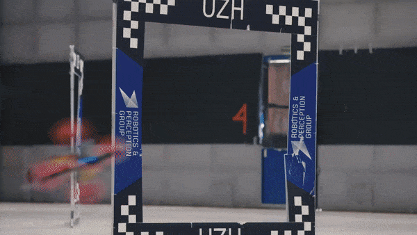

# 无人机产业链结构
## 用途分类

1. 军用无人机：主要用于侦察预警、跟踪定位、军事打击和战场搜救等任务。
2. 民用无人机：包括消费级无人机和工业级无人机，应用于航空拍摄、农林植保、物流运输、环境监测等多方领域。

## 现代产业结构

1. 无人机产业链上游为无人机设计研发及关键原材料的生产
2. 中游无人机整机制造包括飞行系统、地面系统、任务载荷系统三个方面，是无人机制造的核心部分
3. 无人机产业链下游是无人机的应用场景，应用场景涵盖生活方方面面

# 无人机重要模块介绍
## 飞行控制系统（Flight Control System, FCS）
这是无人机的“大脑”，负责控制飞行轨迹、高度和速度等参数。飞控系统通常由控制器、传感器和GPS等组成。

### 悬停
在悬停状态下，四个旋翼具有相等的转速，产生的上升合力正好与自身重力相等。并且因为旋翼转速大小相等，前后端转速和左右端转速方向相反，从而使得飞行器总扭矩为零，使得飞行器静止在空中，实现悬停状态。

### 垂直运动
垂直运动是五种运动状态中较为简单的一种，在保证四旋翼无人机每个旋转速度大小相等的倩况下，同时对每个旋翼增加或减小大小相等的转速，便可实现飞行器的垂直运动。

当同时増加四个旋翼转速时，使得旋翼产生的总升力大小超过四旋翼无人机的重力时，即，四旋翼无人机便会垂直上升；反之，当同时减小旋翼转速时，使得每个旋翼产生的总升力小于自身重力时，即，四旋翼无人机便会垂直下降，从而实现四旋翼无人机的垂直升降控制。

### 翻滚运动
翻滚运动是在保持四旋翼无人机前后端旋翼转速不变的情况下，通过改变左右端的旋翼转速，使得左右旋翼之间形成一定的升力差，从而使得沿飞行器机体左右对称轴上产生一定力矩，导致在方向上产生角加速度实现控制的。

如图所示，增加旋翼1的转速，减小旋翼3的转速，则飞行器倾斜于右侧飞行；相反，减小旋翼４，增加旋翼２，则飞行器向左倾斜飞行。

### 俯仰运动
四旋翼飞行器的俯仰运动和滚动运动相似，是在保持机身左右端旋翼转速不变的前提下，通过改变前后端旋翼转速形成前后旋翼升力差，从而在机身前后端对称轴上形成一定力矩，引起角方向上的角加速度实现控制的。

如图所示，增加旋翼３的转速，减小旋翼１的转速，则飞行器向前倾斜飞行；反之，则飞行器向后倾斜。

### 偏航运动
四旋翼的偏转运动是通过同时两两控制四个旋翼转速实现控制的。

保持前后端或左右端旋翼转速相同时，其便不会发生俯仰或滚动运动；而当每组内的两个旋翼与另一组旋翼转速不同时，由于两组旋翼旋转方向不同，便会导致反扭矩力的不平衡，此时便会产生绕机身中心轴的反作用力，引起沿角角加速度。

如图所示，当前后端旋翼的转速相等并大于左右端旋翼转速时，因为前者沿顺时针方向旋转，后者相反，总的反扭矩沿逆时针方向，反作用力作用在机身中心轴上沿逆时针方向，引起逆时针偏航运动；反之，则会引起飞行器的顺时针偏航运动

## 传感器模块
包括陀螺仪、加速度计、磁罗盘、气压计和GPS模块等，用于测量无人机的姿态、速度和位置。

1. 陀螺仪：监测三轴的角速度
2. 加速度计：提供无人机在XYZ三轴方向所承受的加速力。它也能决定无人机在静止状态时的倾斜角度。 
3. 磁罗盘：为无人机提供方向感
4. 气压计：利用大气压力换算出高度，协助无人机导航
5. GPS模块：定经度纬度进行自动飞行，还是保持定位进行悬停

## 动力系统
包括电机和螺旋桨，提供无人机的飞行动力。

# 无人机主流控制算法
## 捷联式惯性导航系统
利用加速度计和陀螺仪测量飞行器的角运动和线运动信息，通过计算模块推算出飞行器的姿态、速度、航向和位置等导航参数。

## PID控制算法
一种线性控制器，通过P比例、I积分和D微分的关系来调节控制量，以实现飞行器的姿态和轨迹控制。PID控制算法在多旋翼无人机中应用广泛。
这里以无人车控制为例子：
### P比例:
想让这个小车沿着绿线向前走，我们给P设置一个固定的值，这个值可以让离开绿线的小车向绿线的方向行驶，离的越远，方向盘打的角度越大，离的越近，方向盘打的角度越小。橙色的箭头表示小车行进的方向

1. 如果我们把P值设置的比较大，它的路径就如上图，因为方向盘打的角度比较大，所以小车比中等P值的时候较早的到达绿线，但同样因为惯性的原因会多次往返绿线的两侧，也是一次比一次接近绿线，因为它方向盘角度打的比较大，所以会比中等P值往返的次数要多，最终经过多次往返，理论上它会离绿线越来越近，最终到达绿线上方。

2. 如果我们把P值设置的比较小，也就是方向盘打的角度比较小，它的路径是这样的，小车会较晚到达绿线，因为惯性会往返绿线两侧，但是因为方向盘角度小，小车可以在较少的往复次数下接近绿线。
   

**在小车与绿线相同距离的情况下，P值越大，小车的反应越快，P值越小，小车的反应越慢，所以这三个小车第一次到达绿线的时间是不一样的**

### D微分：
我们为了不让这个小车冲过头，我们再给它加一个力，这个力就是D，让这个力来起一个作用，就是让小车越接近绿线的时候，接近绿线的速度越慢，小车越远离绿线的时候，接近绿线的速度相对较快，这个接近绿线的速度不是小车前进的速度，是小车与绿线平行线之间的相对速度。这个D大家可以理解为小车靠近绿线的一个阻力。

1. 如果D值过大，也就是小车靠近绿线的阻力过大，这样会让小车需要比较长的时间才能到达绿线上方。
2. 如果D值设置的过小，也就是小车靠近绿线的阻力过小，那微分控制(D)就不会对比例控制产生大的影响，所以虽然小车能够较快到达绿线，但小车需要多调整几次，在绿线的两侧往复几次后才能到达绿线上方行驶。

### I积分：
设置合适的P值和D值，可以让小车很好的沿着绿线一直走，但路上不是很平坦，会有些坑坑包包，或者其他的一些干扰，路况不好就会让小车的行进路线发生偏移，比如小车在这里遇到了坑坑包包，它的行进路线 就会变成这样，稍微偏离了绿线一点，因为微分控制（D）让小车离绿线越近时，靠近绿线的速度越慢，比例控制（P）让小车在接近绿线时，方向盘又打的比较小，所以小车要走一段路才回到绿线上面。

有没有办法让它**更快回到绿线上面**呢，所以我们再给它加一个力，这个力就是I，积分控制。我们让积分控制起这样的作用：如果P和D的调节不是很理想的话，就让I帮他俩一把，向P的方向上加一个力，这样可以让小车更快回到目的路径。

设置了I以后，I会根据误差和误差经历的时间进行积分，然后决定施加给目标方向的力的大小，就能够让小车回到目标轨迹上。

# 发展展望
## 以自主控制为代表的无人机智能化水平在未来将得到大幅度提升。

### 军用
在采用人工智能和群体智能优化技术后，军用无人机/机群可远在几百公里甚至几千公里外自主完成自动寻的、确定攻击目标先后次序、选定适宜的打击手段、进行战术协同执行攻击等一系列战术动作。

### 民用
随着民用无人机应用场景的不断拓展，基于大数据和人工智能的技术加持，民用无人机将在警用、保值、配送、检测等众多应用领域充分发挥其作用。

#### 浙江大学全自主微型飞行机器人集群
1. 构建轨迹规划器，根据来自机载传感器的有限信息及时准确地运行。
2. 规划问题满足飞行效率、避障、机器人间碰撞避免、动力学可行性、群体协同等多种任务需求，实现可扩展的规划器。
3. 具有机载感知、定位和控制功能，在轨迹质量和计算时间方面的卓越性能。
[视频](https://www.bilibili.com/video/BV1qv4y1K7Y6/?t=74.26794&spm_id_from=333.1350.jump_directly&vd_source=6718fb46dbdd603565f483b04b4cdb50)

#### 苏黎世大学基于视觉飞行的开源和开源硬件敏捷四旋翼飞行器
70km/h的运动捕捉系统的轨迹跟踪，以及仅使用机载感知在结构化和非结构化环境中进行基于视觉的特技飞行和避障。
